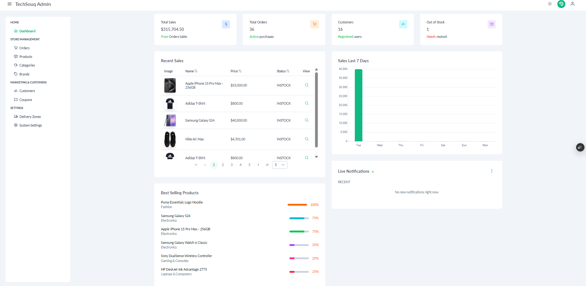
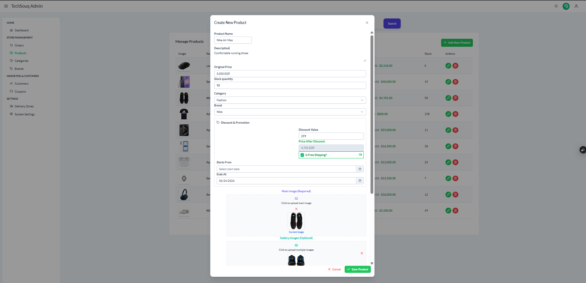
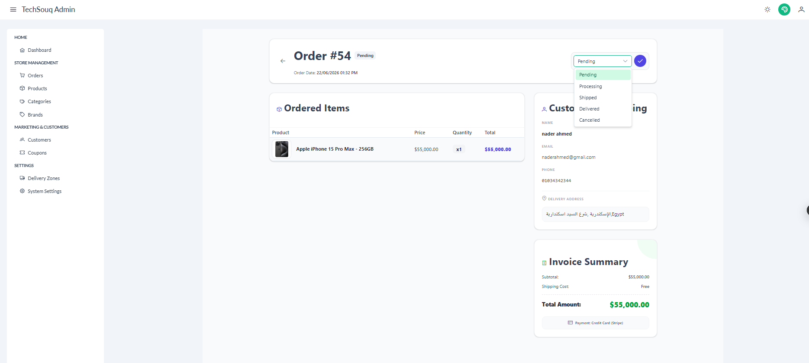

# TechSouq Admin Dashboard

An admin dashboard for the TechSouq e-commerce platform, built with Angular 21, PrimeNG, Tailwind CSS, and SignalR.

## Overview

TechSouq Admin provides an administrative interface for managing the main operations of an e-commerce platform.

The dashboard communicates with the TechSouq backend API and includes catalog management, order processing, customer management, marketing tools, system settings, analytics, and real-time notifications.

## Features

### Dashboard & Analytics

- Sales and revenue analytics
- Recent sales
- Best-selling products
- Dashboard statistics
- Real-time notifications

### Catalog Management

- Product management
- Category management
- Brand management
- Product image management
- Rich-text product descriptions

### Order Management

- Orders management
- Server-side pagination
- Order status management
- Order details
- Customer and shipping information
- Invoice details

### Customers

- Customer listing
- Customer information management

### Marketing

- Coupon management
- Percentage and fixed-amount discounts
- Usage limits
- Expiration dates
- Delivery zones and shipping costs

### System

- System settings
- Admin authentication
- Protected admin routes
- Role-based access control
- Responsive dashboard
- Dark / Light mode

## Tech Stack

### Framework

- Angular 21
- TypeScript
- RxJS

### UI & Styling

- PrimeNG 21
- PrimeNG Aura Theme
- Tailwind CSS 4
- PrimeIcons

### Additional Libraries

- Chart.js
- Quill Editor

### Real-Time Communication

- Microsoft SignalR

### Development Tools

- Angular CLI
- ESLint
- Prettier

### Testing

- Jasmine
- Karma

## Architecture

The application uses Angular Standalone Components and a feature-based structure.

### Core

The `core` area contains application-wide functionality such as:

- Authentication services
- HTTP interceptors
- Route guards
- Shared interfaces
- Application services

### Pages / Features

Business functionality is organized into separate feature areas:

- Authentication
- Dashboard
- Products
- Categories
- Brands
- Orders
- Order Details
- Customers
- Coupons
- Delivery Zones
- System Settings

### Layout

The layout contains the main dashboard shell and reusable layout components such as:

- Sidebar
- Topbar
- Menu
- Footer
- Layout configuration

## Authentication & Authorization

The dashboard protects administrative routes using an Angular route guard.

Authentication is integrated with the backend API, while an HTTP interceptor handles authenticated HTTP requests.

The application also uses role-based access checks for protected admin functionality.

## HTTP Client & Interceptors

Angular's `HttpClient` is configured with the Fetch API through `withFetch()`.

A custom HTTP interceptor is used to handle authentication credentials for API requests.

## Real-Time Notifications

SignalR is used to establish a real-time connection with the backend.

This allows the dashboard to receive live notifications without requiring the administrator to refresh the page.

## Routing

The application uses Angular Router with lazy-loaded standalone components for the main dashboard features.

Protected dashboard routes are guarded by the admin authorization guard.

## UI & Theming

PrimeNG provides the main UI component library, while the Aura theme and Tailwind CSS are used for styling and customization.

The dashboard supports both Dark and Light modes.

## API Integration

The frontend communicates with the TechSouq ASP.NET backend API through dedicated Angular services.

API configuration is separated into development and production environment files.

## Rich Text Editing

Quill Editor is used for creating and editing rich-text product descriptions.

## Data Visualization

Chart.js is used to display dashboard analytics and revenue-related visualizations.

## Testing

The project includes Angular unit testing support using:

- Jasmine
- Karma

## Getting Started

### Prerequisites

- Node.js
- Angular CLI

### Clone the Repository

```bash
git clone https://github.com/Hosny-Ayman/TechSouq-Admin.git
cd TechSouq-Admin
```

### Install Dependencies

```bash
npm install
```

### Run the Application

```bash
npm start
```

The development server runs on:

```text
http://localhost:4201
```

### Build the Application

```bash
npm run build
```

### Run Tests

```bash
npm test
```

## Backend

This dashboard communicates with the TechSouq backend API.

### Backend Repository

[TechSouq Backend](https://github.com/Hosny-Ayman/TechSouq-Backend)

## Live Demo

[TechSouq Admin Dashboard](https://tech-souq-dashboard.vercel.app/)

### Demo Account

```text
Email: demo@techsouq.com
Password: Demo123!
```

The demo account is intended for exploring the dashboard in the shared live environment.

## Screenshots

### Dashboard



### Product Management



### Order Details



## License

This project is licensed under the MIT License. See the [LICENSE](LICENSE.md) file for details.
